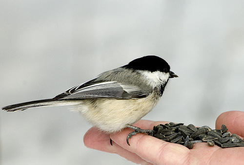

# Image Caption Generator

An end-to-end, production-oriented image captioning system: given a photo, the model generates a natural-language description of it. Built on the **Flickr8k dataset**, combining a **frozen pretrained ResNet50** (Computer Vision / transfer learning) with an **LSTM decoder** (NLP / sequence generation).

This project intentionally goes beyond a single notebook — it's organized into a modular, testable Python package with a config-driven, plug-and-play architecture (swap encoders/decoders via one config file), a full training/evaluation pipeline, unit tests, three deployment interfaces (FastAPI, Streamlit, Gradio on Hugging Face Spaces), and a Dockerfile.

- **Live demo (Hugging Face Space):** https://huggingface.co/spaces/AdhamAshraf/image_caption_generator
- **Trained model weights:** https://huggingface.co/AdhamAshraf/image-caption-generator
- **Source code:** https://github.com/adhamashraf7788/Image-Caption-Generator

---

## Table of Contents

- [Project Overview](#project-overview)
- [Dataset](#dataset)
- [Architecture](#architecture)
- [Preprocessing](#preprocessing)
- [Training Process](#training-process)
- [Evaluation: Metrics and Results](#evaluation-metrics-and-results)
- [Project Structure](#project-structure)
- [Installation](#installation)
- [How to Run](#how-to-run)
- [How to Use the Application / API](#how-to-use-the-application--api)
- [Demo Video](#demo-video)
- [Docker](#docker)
- [What Was Tried / Design Decisions](#what-was-tried--design-decisions)
- [Known Limitations & Next Steps](#known-limitations--next-steps)

---

## Project Overview

Given an input image, the system:
1. Extracts a visual feature vector using a **frozen, pretrained ResNet50** (transfer learning — no CNN training from scratch).
2. Projects that feature vector into a shared embedding space.
3. Feeds it into an **LSTM decoder**, which generates a caption word-by-word (greedy decoding).

The project satisfies both ML and software-engineering goals: a working CV+NLP pipeline, plus modular code, config-driven experiments, unit tests, checkpointing, quantitative + qualitative evaluation, and three separate deployable interfaces.

## Dataset

**Flickr8k** — 8,091 images (this repackaged Kaggle release; the "official" release is 8,000), each paired with **5 human-written reference captions** (40,455 captions total).

**Split strategy:** captions are split by **unique image**, not by caption, to avoid data leakage (an image's 5 captions must never be split across train/val/test). Using a fixed seed (42):

| Split | Images | Caption pairs |
|---|---|---|
| Train | 6,472 (80%) | 32,360 |
| Val   | 809 (10%)   | 4,045 |
| Test  | 810 (10%)   | 4,050 |

> Note: this is a custom seeded 80/10/10 split (the raw download used here ships without the "official" `trainImages.txt`/`devImages.txt`/`testImages.txt` files some Flickr8k releases include). Results here are therefore not directly comparable to papers using the official split, though the split methodology (by image, not caption) is the same.

## Architecture

**Baseline: ResNet50 (frozen) → Linear projection → LSTM decoder** ("Show and Tell" style — image fed as the first input token to the LSTM).

```
Image → preprocess (resize/crop/normalize)
      → ResNet50 (frozen, ImageNet-pretrained, classification head removed)
      → 2048-d feature vector
      → Linear(2048 → 256) + ReLU + Dropout
      → 256-d "image embedding"
      → fed as the FIRST input step to the LSTM

Caption → normalize/tokenize → numericalize (vocab) → pad
        → word embeddings (256-d) → fed as subsequent LSTM input steps

LSTM (hidden_dim=512, 1 layer) → Linear(512 → vocab_size) → word logits at each step
```

| Component | Choice |
|---|---|
| Encoder | ResNet50, ImageNet-pretrained, **frozen** (no fine-tuning) |
| Feature caching | Features precomputed once and cached to disk (`.pt`) — the encoder never re-runs during training |
| Embedding dim | 256 |
| Decoder | 1-layer LSTM, hidden_dim = 512 |
| Vocabulary size | 2,662 (incl. `<pad>`, `<start>`, `<end>`, `<unk>`) |
| Decoding (inference) | Greedy (argmax at each step) |

### Why a Linear projection layer between encoder and decoder

ResNet50's output (after removing its classification head) is a 2048-dimensional feature vector — that dimensionality is just an artifact of ResNet50's architecture, not something meaningful for captioning. The LSTM's word embeddings, meanwhile, are 256-dimensional. Since the LSTM expects every input in its sequence (image step and word steps alike) to have the *same* dimensionality, something has to convert 2048 numbers into 256 numbers.

That's the entire job of the `Linear(2048, 256)` layer in `src/models/encoder.py`: a learned matrix multiplication (`output = W·x + b`) that compresses the ResNet feature into the shared 256-d embedding space. Unlike a fixed resize/reshape, this projection is **trained** — the network learns which combinations of the 2048 ResNet features are most useful for predicting the next word, rather than us hand-designing that compression.

### Why CNN features are cached instead of recomputed

Because the ResNet50 encoder is **frozen** (no gradients ever flow into it), its output for a given image is mathematically identical every single time — running the same image through it twice produces the same 2048-d vector both times. Recomputing that on every training batch, every epoch, would be pure wasted computation.

Instead, `scripts/extract_features.py` runs every image through ResNet50 **once**, up front, and saves the resulting vectors to `data/features/resnet50_features.pt`. Training then does a fast dictionary lookup (`features[image_filename]`) instead of a CNN forward pass — turning what would be a repeated expensive operation into a one-time cost (8,091 images in ~25 seconds on an RTX 3060) followed by near-instant lookups for the rest of training.

### The plug-and-play registry mechanism

`src/models/registry.py` maps a config string (e.g. `"lstm"`, `"resnet50"`) to the actual Python class that implements it:
```python
DECODER_REGISTRY = {"lstm": DecoderLSTM}   # more entries added here for future architectures
```
`build_decoder(config, vocab_size)` looks up `config["decoder"]["type"]` in this dictionary and instantiates *only* that one class — it does not build or run every registered option. To add a new architecture (e.g. an attention-based decoder), you write one new class implementing the same `BaseDecoder` interface, add one line to this dictionary, and create a new YAML config pointing `decoder.type` at it. Nothing in `train.py`, `Trainer`, `evaluate.py`, or `predict.py` needs to change, since they all call `build_decoder(...)` generically rather than importing a specific class directly. This is what makes architecture comparisons (baseline vs. attention vs. transformer) a matter of adding files, not editing existing ones.

The codebase uses a **registry pattern** (`src/models/registry.py`) so new encoders/decoders (e.g. attention, transformer) can be added by writing one class + one registry entry + one new YAML config — no other code changes. This baseline is `configs/base_resnet_lstm.yaml`.

### Decoding strategy: greedy search

At inference time, the model has no ground-truth caption to guide it — it has to generate one word at a time, feeding each predicted word back in as the input for the next step (autoregressive generation). At every step, the LSTM produces a score for **every word in the vocabulary** (2,662 scores). **Greedy decoding** simply picks whichever single word has the highest score (`argmax`) at that step, commits to it, and moves on — with no ability to reconsider that choice later, even if it leads the sentence into an incoherent dead end.

```python
logits = self.fc(lstm_out.squeeze(1))              # a score for every word in the vocabulary
predicted_idx = int(logits.argmax(dim=-1).item())   # take only the single highest-scoring word
```

This is the simplest possible decoding strategy — easy to implement, debug, and reason about, which is why the baseline uses it. Its main weakness: if two words are scored very closely at some step, greedy always takes the marginally higher one and never looks back, even when the slightly-lower-scoring alternative would have led to a much better overall sentence. This is a likely contributor to the broken output seen in the [out-of-distribution failure case](#failure-case-out-of-distribution-images) below.

**Beam search** (not yet implemented) is the standard alternative: instead of keeping only the single best word at each step, it tracks the top-K most likely *partial sequences* simultaneously, and only commits to a final caption once the whole sequence is scored — allowing a slightly lower-scoring early word choice to still "win" if it leads to a more coherent overall sentence. This requires no retraining, only a different `generate()` implementation, making it a natural low-cost next step.

## Preprocessing

**Images:**
- Resize shorter side to 256px, center-crop to 224×224 (ResNet50's expected input size)
- Convert to tensor, normalize with ImageNet mean/std (`[0.485, 0.456, 0.406]` / `[0.229, 0.224, 0.225]`)
- Identical transform used at train, val, test, and inference time (`src/data/preprocessing.py`)

**Captions:**
- Lowercase, strip punctuation, collapse whitespace, whitespace-tokenize
- Wrap with `<start>` / `<end>`
- Vocabulary built **from the training split only** (avoids leakage), keeping words with frequency ≥ 5; rarer words map to `<unk>`
**Vocabulary construction and `<unk>` handling:** the vocabulary is built **only from the training split's captions** (never val/test — this avoids leaking information about what words exist in "unseen" data). Words appearing fewer than 5 times (`min_freq=5`) are excluded from the vocabulary and mapped to `<unk>` instead of getting their own index — Flickr8k captions contain many one-off rare words (misspellings, unusual phrasings), and keeping every unique word would bloat the vocabulary with entries the model would see only once or twice, hurting generalization. This threshold reduced the raw vocabulary down to 2,662 words. The trade-off: some genuinely descriptive but rare words become `<unk>` at both training and inference time — a deliberate choice favoring a more learnable, generalizable output space over maximum vocabulary coverage.

- Numericalized and padded/truncated to a fixed max length (35 tokens)

**Feature caching:** since the CNN encoder is frozen, its output for a given image never changes — so every image is run through ResNet50 **once**, and the resulting 2048-d vectors are cached to disk (`data/features/resnet50_features.pt`). Training reads from this cache instead of recomputing CNN features every epoch (8,091 images extracted in ~25 seconds on an RTX 3060).

## Training Process

- **Loss:** Cross-entropy, ignoring `<pad>` positions
- **Optimizer:** Adam, initial lr = 1e-3
- **LR scheduling:** `ReduceLROnPlateau` (factor 0.5, patience 2 epochs on val loss)
- **Early stopping:** patience 5 epochs (no val loss improvement)
- **Checkpointing:** best model (lowest val loss) and last-epoch model both saved every epoch, enabling `--resume`
- **Teacher forcing:** ground-truth previous word fed at each decoder step during training (not the model's own prediction), allowing the whole sequence to be processed in one parallel forward pass per batch

### Why teacher forcing (and how it differs from inference)

During training, the correct caption is already known, so at each decoder step the model is fed the **true** previous word from the dataset — never its own (possibly wrong) prediction. Concretely, for the true caption `<start> a dog runs <end>`, the model sees `<start>` and must predict `a`; separately, it's shown the true `a` (regardless of what it predicted) and must predict `dog`; and so on. Because every input in the sequence is already known ahead of time, the entire sequence can be processed in **one parallel forward pass** per batch — no step-by-step loop needed during training, which is what makes training fast.

This is fundamentally different from **inference** (see [Decoding strategy](#decoding-strategy-greedy-search) above), where there's no ground-truth caption available — the model must feed its *own* predictions back in as input for the next step, one at a time, in a loop. This means a wrong prediction early in inference can compound into further errors later in the sequence (an effect teacher forcing prevents from happening during training) — a well-known mismatch between training and inference conditions in sequence generation, and part of why generated captions can sometimes diverge from what training loss alone would suggest.

**Actual training run** (RTX 3060, batch size 32):

| Epoch | Train Loss | Val Loss | LR |
|---|---|---|---|
| 1 | 3.5452 | 3.0476 | 1e-3 |
| 2 | 2.8399 | 2.8323 | 1e-3 |
| 3 | 2.5703 | 2.7623 | 1e-3 |
| **4** | **2.3746** | **2.7350** ⭐ best | 1e-3 |
| 5 | 2.2038 | 2.7508 | 1e-3 |
| 6 | 2.0496 | 2.7792 | 1e-3 |
| 7 | 1.9066 | 2.8252 | 5e-4 |
| 8 | 1.6822 | 2.8361 | 5e-4 |
| 9 | 1.5876 | 2.8757 | 5e-4 |

Early stopping triggered after epoch 9 (5 epochs with no improvement over epoch 4). The LR scheduler correctly halved the learning rate at epoch 7 after 2 stagnant epochs, though this wasn't enough to reverse the overfitting trend. **The checkpoint used for inference/evaluation is from epoch 4** (lowest val loss), not epoch 9 — this is what early stopping is designed to do.

Train loss continuing to drop (3.55 → 1.59) while val loss climbs after epoch 4 is a textbook overfitting signature for a first baseline with no dropout tuning, no augmentation, and a fairly small training set relative to vocabulary/sequence complexity — expected for an initial baseline, and a natural target for future optimization (not pursued in this iteration; see [What Was Tried](#what-was-tried--design-decisions)).

## Evaluation: Metrics and Results

Evaluated on the held-out **test set** (810 unique images, 4,050 reference captions), using the epoch-4 checkpoint, greedy decoding, and each generated caption scored against all 5 references per image.

| Metric | Score |
|---|---|
| BLEU-1 | 0.5127 |
| BLEU-2 | 0.3265 |
| BLEU-3 | 0.2008 |
| BLEU-4 | 0.1221 |
| ROUGE-L | 0.4177 |
| METEOR | 0.3266 |

BLEU-4 (the most commonly reported single figure for image captioning) of **0.12** is a working, honest baseline — somewhat below well-tuned literature baselines for this architecture family on Flickr8k (which often reach ~0.15–0.20 with more epochs, dropout tuning, and/or beam search), consistent with this being an intentionally minimal first baseline.

## Optimization Experiments: Beam Search & Regularization

After establishing the baseline, two follow-up experiments were run to directly address the overfitting and decoding weaknesses identified above — both evaluated on the same held-out test set for direct comparison.

### Experiment 1: Beam search decoding (no retraining)

Since the baseline's training was already complete, beam search (beam width 3) was tested purely as an **inference-time change** against the existing baseline checkpoint — no retraining required. Implementation: `DecoderLSTM.generate_beam()` keeps the top-3 candidate partial sequences at each decoding step (instead of committing to a single highest-scoring word, as greedy decoding does), only finalizing a caption once whole-sequence scores are compared.

| Metric | Greedy | Beam-3 | Change |
|---|---|---|---|
| BLEU-1 | 0.5127 | 0.5240 | +0.0113 |
| BLEU-2 | 0.3265 | 0.3362 | +0.0097 |
| BLEU-3 | 0.2008 | 0.2136 | +0.0128 |
| BLEU-4 | 0.1221 | 0.1364 | **+0.0143 (+11.7%)** |
| ROUGE-L | 0.4177 | 0.4265 | +0.0088 |
| METEOR | 0.3266 | 0.3267 | ~flat |

Beam search improved every metric except METEOR (essentially unchanged), confirming the hypothesis that greedy decoding's single-best-word-at-each-step commitment was leaving quality on the table — at the cost of ~1.7x slower inference (24s vs 14s over 810 test images), since multiple candidate sequences are tracked and scored per image instead of one.

### Experiment 2: Regularized retrain

A second training run (`configs/resnet_lstm_regularized.yaml`) added several regularization techniques directly targeting the overfitting pattern observed in the baseline (train loss dropping while val loss climbed, starting epoch 4):

| Change | Baseline | Regularized |
|---|---|---|
| LSTM output dropout | 0.0 (unused — `nn.LSTM`'s `dropout` arg has no effect with `num_layers=1`) | 0.3 (applied explicitly to LSTM output before final projection) |
| Weight decay (L2) | 0.0 | 1e-5 |
| Gradient clipping | none | max norm 5.0 |
| Early stop patience | 5 epochs | 8 epochs |

**Training outcome:** the regularized run trained for 18 epochs before early stopping (vs. 9 for the baseline), and reached a lower best validation loss:

| | Baseline | Regularized |
|---|---|---|
| Best epoch | 4 | 10 |
| Best val loss | 2.7350 | **2.6672** |
| Total epochs before stopping | 9 | 18 |

Notably, **even the regularized run still overfits** — train loss continued falling (2.19 → 1.71 from epoch 9 to 18) while val loss crept back up despite the LR scheduler repeatedly halving the learning rate (5e-4 → 1.25e-4). Regularization measurably delayed and deepened the best point, but did not eliminate the underlying overfitting dynamic — running for more epochs would not have helped further, since val loss was already degrading even at very small LR.

**Evaluation results — regularized checkpoint, greedy vs. beam:**

| Metric | Regularized + Greedy | Regularized + Beam-3 |
|---|---|---|
| BLEU-1 | 0.5444 | 0.5517 |
| BLEU-2 | 0.3580 | 0.3662 |
| BLEU-3 | 0.2277 | 0.2387 |
| BLEU-4 | 0.1435 | **0.1557** |
| ROUGE-L | 0.4434 | 0.4527 |
| METEOR | 0.3480 | 0.3528 |

### Full comparison: all four configurations

| Configuration | BLEU-4 | ROUGE-L | METEOR |
|---|---|---|---|
| Baseline + greedy | 0.1221 | 0.4177 | 0.3266 |
| Baseline + beam-3 | 0.1364 | 0.4265 | 0.3267 |
| Regularized + greedy | 0.1435 | 0.4434 | 0.3480 |
| **Regularized + beam-3** | **0.1557** | **0.4527** | **0.3528** |

Both interventions are additive and stack cleanly: regularization alone improved BLEU-4 by ~17% over the baseline (0.1221 → 0.1435), and adding beam search on top of the regularized model improved it a further ~8.5% (0.1435 → 0.1557) — a combined **~27% relative improvement in BLEU-4** over the original baseline, achieved through better training-time regularization and a smarter (but still retraining-free) decoding strategy, without changing the underlying architecture at all.

### Qualitative examples (Input Image → Generated Caption → References)

| Image | Generated | References |
|---|---|---|
| 1003163366_44323f5815.jpg | a man in a white shirt and jeans is standing in front of a brick building | A man lays on a bench while his dog sits by him. / A man lays on the bench to which a white dog is also tied. / a man sleeping on a bench outside with a white and black dog sitting next to him. / A shirtless man lies on a park bench with his dog. / man laying on bench holding leash of dog sitting on ground |
| 1007129816_e794419615.jpg | a man in a black shirt is holding a camera | A man in an orange hat starring at something. / A man wears an orange hat and glasses. / A man with gauges and glasses is wearing a Blitz hat. / A man with glasses is wearing a beer can crocheted hat. / The man with pierced ears is wearing glasses and an orange hat. |
| 1019077836_6fc9b15408.jpg | a brown dog is jumping over a fence | A brown dog chases the water from a sprinkler on a lawn. / a brown dog plays with the hose. / A brown dog running on a lawn near a garden hose / A dog is playing with a hose. / Large brown dog running away from the sprinkler in the grass. |
| 1082379191_ec1e53f996.jpg | a man in a white shirt is jumping into a pool | A lady and a man with no shirt sit on a dock. / A man and a woman are sitting on a dock together. / A man and a woman sitting on a dock. / A man and woman sitting on a deck next to a lake. / A shirtless man and a woman sitting on a dock. |
| 109260216_85b0be5378.jpg | a man climbs up a rock face | A person climbing down a sheer rock cliff using a rope / A person climbs a tall, flat mountain while holding onto a safety rope. / A person is climbing a rock while holding onto a white rope. / A person rappels down a steep incline. / A person wearing a red vest climbs up a steep rock. |

Full 12-example report: `models/base_resnet_lstm/eval_qualitative.md`.

**Observed pattern:** the model reliably produces fluent, grammatically well-formed captions matching Flickr8k's typical sentence structure ("a [subject] in a [color] [item] is [verb]-ing..."), but frequently doesn't ground the caption in the image's actual specific content — e.g. captioning a man asleep on a bench with a dog as "a man in a white shirt... in front of a brick building." This suggests the model is leaning on **language-model priors** (common caption openings) more than the 256-d image embedding signal, likely a consequence of early stopping at epoch 4 combined with a single, static global image vector. This is a known weak point of this exact architecture family and is the direct motivation for trying an **attention-based decoder** as a follow-up comparison (not yet implemented in this iteration).

## Project Structure

```
image-caption-generator/
├── configs/                  # YAML experiment configs (architecture + hyperparameters)
├── data/
│   ├── raw/                  # images/ + captions.txt (not committed — see Installation)
│   ├── processed/            # train/val/test.csv, vocab.json
│   └── features/             # cached ResNet50 feature vectors (.pt)
├── src/
│   ├── data/                 # preprocessing, vocabulary, PyTorch Dataset
│   ├── features/             # frozen CNN feature extractor
│   ├── models/                # base classes, encoder, decoder, registry, CaptionModel
│   ├── training/              # Trainer class + train.py entrypoint
│   ├── evaluation/             # BLEU/ROUGE/METEOR metrics + evaluate.py
│   ├── inference/              # Predictor class (single source of truth for generation)
│   └── utils/                  # config loader
├── scripts/                  # split_dataset.py, build_vocab.py, extract_features.py, push_to_hub.py
├── app/                       # FastAPI (api.py) + Streamlit (streamlit_app.py)
├── tests/                     # unit tests (pytest)
├── models/<run_name>/         # checkpoints, config.yaml, training_log.csv, eval results
├── Dockerfile
└── requirements.txt
```

## Installation

```bash
git clone https://github.com/adhamashraf7788/Image-Caption-Generator.git
cd Image-Caption-Generator

python -m venv venv
source venv/bin/activate        # Windows: venv\Scripts\activate

pip install -r requirements.txt
python -c "import nltk; nltk.download('wordnet'); nltk.download('omw-1.4')"
```

**Dataset:** download Flickr8k (e.g. the Kaggle "flickr8k" dataset by adityajn105) and place it as:
```
data/raw/images/*.jpg
data/raw/captions.txt      # columns: image, caption
```

## How to Run

Run once, in order, to prepare data and train:

```bash
python -m scripts.split_dataset --config configs/base_resnet_lstm.yaml
python -m scripts.build_vocab --config configs/base_resnet_lstm.yaml
python -m scripts.extract_features --config configs/base_resnet_lstm.yaml
python -m src.training.train --config configs/base_resnet_lstm.yaml
```

Evaluate on the test set:
```bash
python -m src.evaluation.evaluate --config configs/base_resnet_lstm.yaml
```

Run the test suite:
```bash
python -m pytest tests/ -v
```

> Note: run all `scripts/` and `src/` entrypoints as modules (`python -m ...`), not as bare file paths — this ensures the `src` package resolves correctly regardless of working directory.

## How to Use the Application / API

**Option 1 — Hugging Face Space (no setup required):**
https://huggingface.co/spaces/AdhamAshraf/image_caption_generator
Upload an image in the browser, get a caption back.

**Option 2 — FastAPI (local):**
```bash
uvicorn app.api:app --reload --host 0.0.0.0 --port 8000
```
Open `http://localhost:8000/docs`, use the interactive Swagger UI to `POST /predict` with an image file. Returns:
```json
{ "caption": "a man and a woman are sitting on a dock by a lake" }
```

**Option 3 — Streamlit (local):**
```bash
streamlit run app/streamlit_app.py
```
Opens a browser UI at `http://localhost:8501` — upload an image, caption appears below it.

All three interfaces share the exact same `Predictor` class (`src/inference/predict.py`), so behavior is identical across all of them.

## Demo Video

`docs/demo.mp4` — screen recording showing the same image being captioned through all three interfaces (Hugging Face Space, FastAPI Swagger UI, Streamlit).

<!-- Once recorded and committed to docs/demo.mp4, GitHub will render it inline below: -->
<!--  -->

## Docker

```bash
docker build -t image-caption-generator .
docker run -p 8000:8000 image-caption-generator
```
Then open `http://localhost:8000/docs` — same FastAPI interface, running fully containerized.

## What Was Tried / Design Decisions

- **Frozen ResNet50 + feature caching**, rather than fine-tuning the CNN or running it live every epoch — deliberate speed/simplicity trade-off appropriate for an 8k-image dataset and a first baseline.
- **Image-as-first-LSTM-token** fusion strategy (vs. using the image to initialize LSTM hidden state) — simpler to implement/debug, standard "Show and Tell" baseline choice.
- **Greedy decoding** for the initial baseline, rather than beam search — beam search was subsequently implemented and evaluated as a direct comparison (see [Optimization Experiments](#optimization-experiments-beam-search--regularization)), improving BLEU-4 by ~11.7% with no retraining required.
- **Config + registry architecture** (`src/models/registry.py`) so alternative encoders (e.g. EfficientNet, InceptionV3) or decoders (attention-based LSTM, transformer) can be added without modifying training/evaluation/inference code — built specifically to support architecture comparisons; the ResNet50+LSTM baseline and a regularized variant were both trained via this system in this iteration.
- **Split-before-vocab, image-level split** — vocabulary is built only from the training split and images (not individual captions) are the split unit, both specifically to prevent data leakage.
- **min_freq=5 vocabulary threshold** — reduces vocabulary from Flickr8k's full raw vocabulary down to 2,662 words, trading a small amount of `<unk>` coverage for a more learnable output space.
- Initially **did not pursue optimization** in the first iteration, in order to get a complete, working, evaluated, and deployed end-to-end system first — beam search and regularization were then added and evaluated as a documented follow-up (see [Optimization Experiments](#optimization-experiments-beam-search--regularization)), directly targeting the overfitting and decoding weaknesses the baseline evaluation surfaced.

## Known Limitations & Next Steps

- **Overfitting persists even after regularization** — dropout, weight decay, and gradient clipping delayed and deepened the best validation point (epoch 4 → 10, val_loss 2.735 → 2.667) but did not eliminate the fundamental overfitting dynamic; val loss degraded again even as the LR scheduler reduced the learning rate to 1.25e-4, indicating more epochs alone would not help further. Remaining candidates: stronger dropout, data augmentation, or a fundamentally more data-efficient architecture.
- Generated captions are fluent but frequently not well-grounded in image-specific detail (see qualitative examples) — primary motivation for trying an **attention-based decoder** next, which lets the model attend to different image regions per generated word instead of relying on one static global vector.
- Only one architecture family (ResNet50 + LSTM, baseline and regularized variants) has been trained and evaluated so far; the registry-based design supports adding EfficientNet/InceptionV3 encoders and attention/transformer decoders as directly comparable experiments (new config file, no other code changes).
- Beam search (width 3) is implemented and measurably helps (see above); wider beams, length normalization, or diverse beam search are unexplored follow-ups.

### Failure case: broken output on a training-set image

Testing with a bird-close-up image (`111766423_4522d36e56.jpg`) produced a grammatically broken output:



| Image | Generated | Reference (from training data) |
|---|---|---|
| black-and-white bird eating seeds from a person's hand | `a bird is its wings in a` | "A black and white bird eating seeds out of someone's hand." |

This image is not out-of-distribution — it is one of the 32,360 training pairs the model was directly trained on (confirmed in `data/processed/train.csv`). That the model still produces an incoherent, ungrammatical sequence on an image it was trained on is a more concerning finding than a failure on genuinely unfamiliar content would be, and points to two compounding issues rather than distribution shift:

1. **Underfitting/early stopping** — training was cut short at epoch 4 (see [Training Process](#training-process)) specifically because val loss stopped improving; the model had only partially learned even its own training distribution by that point, and bird/hand close-ups are a comparatively rare image type within Flickr8k, likely undertrained relative to more common scene types (people, dogs, outdoor group photos).
2. **Greedy decoding degeneracy** — even a well-fit model can produce incoherent sequences under greedy (argmax) decoding if the model's confidence is low or evenly split between competing words at some step, since greedy commits immediately with no ability to reconsider (see [Decoding strategy](#decoding-strategy-greedy-search) above). Given the model *has* seen this image's reference captions during training, decoding-time behavior — not the underlying learned representation alone — is a plausible major contributor to this specific failure.

**Beam search** (tracking multiple candidate sequences instead of committing greedily at each step) is a concrete, no-retraining-required candidate for reducing this class of failure, and remains the most immediate next step identified in this project.

> **Update:** beam search was subsequently implemented and tested directly on this image (baseline checkpoint): greedy produced `"a bird is its wings in a"`, while beam-3 produced `"a white bird its wings"` — an improvement in grammaticality (the dangling fragment is gone) but still not a fully coherent sentence. This confirms beam search helps but is not sufficient on its own to fully correct a genuinely undertrained region of the model's learned representation — consistent with the broader finding that regularization changes to training (see [Optimization Experiments](#optimization-experiments-beam-search--regularization)) were needed in addition to the decoding-strategy change to meaningfully move overall test-set metrics.

> **Further update — regularized model + beam search:** re-tested the same image with the regularized checkpoint (`configs/resnet_lstm_regularized.yaml`) using beam-3 decoding:
>
> | Configuration | Generated caption |
> |---|---|
> | Baseline + greedy | `a bird is its wings in a` |
> | Baseline + beam-3 | `a white bird its wings` |
> | **Regularized + beam-3** | **`a black and white bird with its mouth open`** |
>
> This is now a fully coherent, grammatically correct sentence, and semantically reasonable ("black and white bird" is accurate; "mouth open" is a plausible reading of the bird's open beak, even if the ground-truth references describe it eating seeds from a hand rather than mentioning its mouth). This is a concrete, direct confirmation that the combination of regularization (fixing the underlying representation) and beam search (fixing decoding-time commitment errors) resolves this specific failure case that neither change alone fully fixed — matching the additive improvement pattern seen in the aggregate test-set metrics above.